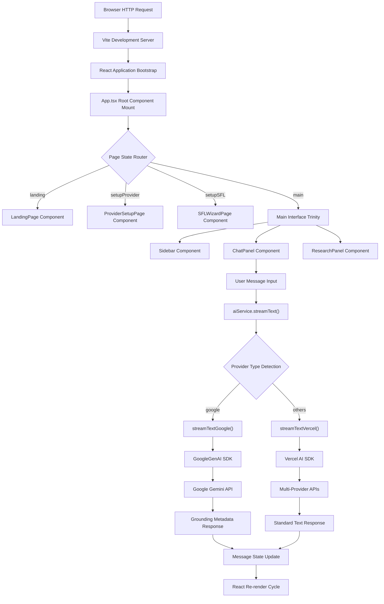
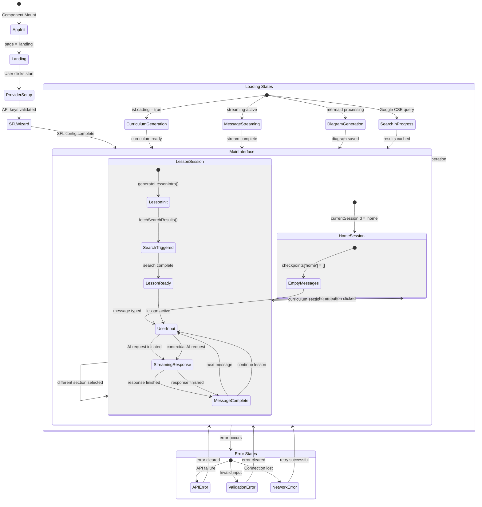
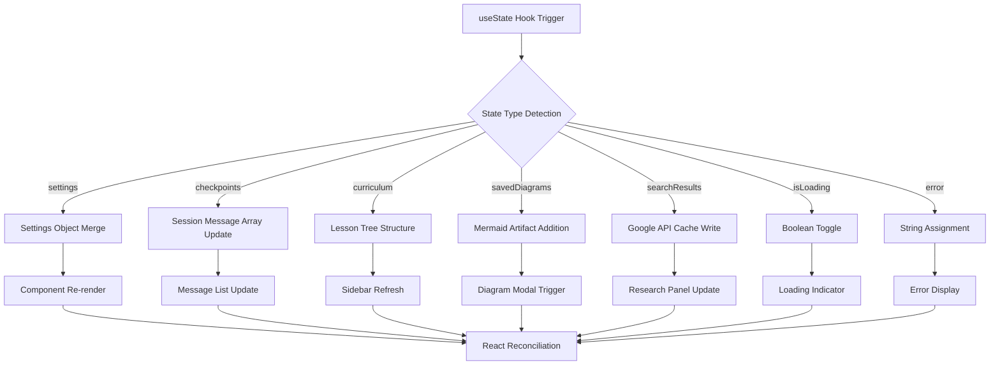
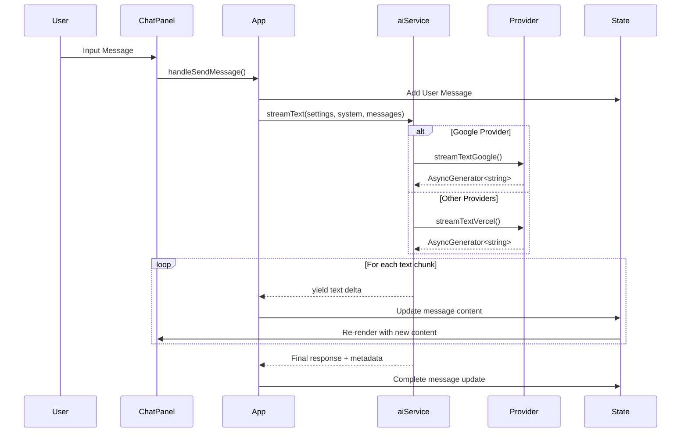
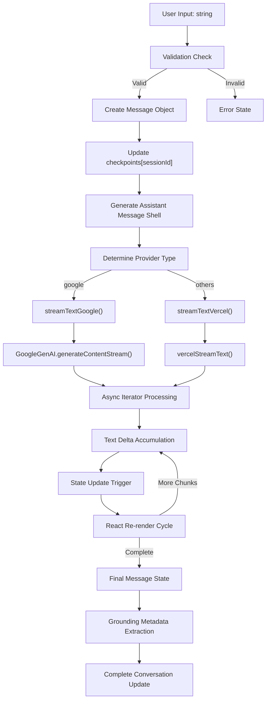
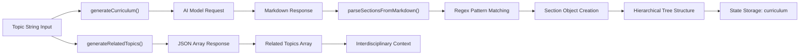

# ARIA: Adaptive Research & Information Assistant

## COMPUTATIONAL SYSTEM OVERVIEW

```shell
┌─────────────────────────────────────────────────────────────────────────────┐
│                            ARIA SYSTEM ARCHITECTURE                         │
│                                                                             │
│  ┌─────────────────┐    ┌─────────────────┐    ┌─────────────────────────┐  │
│  │   BROWSER       │    │   VITE DEV      │    │   EXTERNAL APIS         │  │
│  │   RUNTIME       │◄──►│   SERVER        │◄──►│                         │  │
│  │                 │    │                 │    │  • Google GenAI         │  │
│  │  • React 19.x   │    │  • TypeScript   │    │  • OpenAI               │  │
│  │  • DOM Renderer │    │  • Hot Reload   │    │  • Anthropic            │  │
│  │  • ES2020       │    │  • Asset Bundle │    │  • Mistral              │  │
│  │  • WebSocket    │    │  • Environment  │    │  • OpenRouter           │  │
│  └─────────────────┘    │    Variables    │    │  • ElevenLabs TTS       │  │
│                         └─────────────────┘    │  • Google Custom Search │  │
│                                                └─────────────────────────┘  │
└─────────────────────────────────────────────────────────────────────────────┘
```

## INSTALLATION & EXECUTION PROTOCOL

### PREREQUISITE COMPUTATIONAL REQUIREMENTS

- Node.js runtime environment (version ≥ 16.0.0)
- NPM package manager (bundled with Node.js)
- Minimum 2GB available system memory
- Internet connectivity for API communications

### STEP-BY-STEP BOOTSTRAP SEQUENCE

```bash
# PHASE 1: DEPENDENCY RESOLUTION
npm install

# PHASE 2: ENVIRONMENT CONFIGURATION
# Create .env.local file with precise variable declarations:
echo "GEMINI_API_KEY=your_actual_api_key_string" > .env.local

# PHASE 3: DEVELOPMENT SERVER INSTANTIATION
npm run dev

# PHASE 4: PRODUCTION BUILD COMPILATION
npm run build

# PHASE 5: PRODUCTION PREVIEW SERVER
npm run preview
```

## SYSTEM ARCHITECTURE

### COMPUTATIONAL DATA FLOW SEQUENCE



### COMPONENT HIERARCHY STRUCTURE

```shell
App.tsx [ROOT STATE CONTAINER]
├── LandingPage.tsx [INITIAL ENTRY POINT]
├── ProviderSetupPage.tsx [API KEY CONFIGURATION]
├── SFLWizardPage.tsx [LINGUISTIC FRAMEWORK SETUP]
└── Main Interface [OPERATIONAL WORKSPACE]
    ├── Sidebar.tsx [NAVIGATION & CURRICULUM CONTROL]
    │   ├── SettingsModal.tsx [CONFIGURATION OVERLAY]
    │   └── curriculum sections [DYNAMIC LESSON TREE]
    ├── ChatPanel.tsx [PRIMARY INTERACTION SURFACE]
    │   ├── MessageList.tsx [CONVERSATION HISTORY RENDERER]
    │   ├── Message.tsx [INDIVIDUAL MESSAGE COMPONENT]
    │   ├── ChatInput.tsx [USER INPUT INTERFACE]
    │   ├── ExamplePrompts.tsx [STARTER TEMPLATE GRID]
    │   └── ParagraphMenu.tsx [CONTEXTUAL ACTION MENU]
    └── ResearchPanel.tsx [GOOGLE SEARCH INTEGRATION]
```

#### COMPONENT CLASS DIAGRAM

```mermaid
classDiagram
    class App {
        +Settings settings
        +Record~string, ApiKeyStatus~ apiKeyStatus
        +Curriculum curriculum
        +Record~string, Message[]~ checkpoints
        +string currentSessionId
        +SavedDiagram[] savedDiagrams
        +SearchResults searchResults
        +boolean isLoading
        +string error
        +Page page
        +handleSendMessage(prompt: string)
        +handleGenerateDiagram(text: string)
        +handleGenerateImage(prompt: string)
        +handleTTS(message: Message)
        +handleStartNewLesson(id: string, title: string)
        +renderPage() JSX.Element
    }

    class LandingPage {
        +onStart() void
        +render() JSX.Element
    }

    class ProviderSetupPage {
        +Settings settings
        +setSettings(Settings) void
        +Record~string, ApiKeyStatus~ apiKeyStatus
        +setApiKeyStatus(Record) void
        +onComplete() void
        +validateProvider(provider: Provider)
        +render() JSX.Element
    }

    class SFLWizardPage {
        +SFLConfig initialConfig
        +onFinish(config: SFLConfig, topic: string)
        +handleFieldChange(field: string, value: string)
        +validateConfig() boolean
        +render() JSX.Element
    }

    class Sidebar {
        +Settings settings
        +setSettings(Settings) void
        +Curriculum curriculum
        +string currentSessionId
        +SavedDiagram[] savedDiagrams
        +onSectionClick(id: string, title: string)
        +onViewDiagram(diagram: SavedDiagram)
        +onDeleteDiagram(id: string)
        +onTakeQuiz(moduleId: string)
        +renderCurriculumSections() JSX.Element
        +renderSavedDiagrams() JSX.Element
    }

    class SettingsModal {
        +Settings settings
        +setSettings(Settings) void
        +Record~string, ApiKeyStatus~ apiKeyStatus
        +boolean isOpen
        +onClose() void
        +handleSettingChange(key: string, value: any)
        +validateApiKey(provider: Provider)
        +render() JSX.Element
    }

    class ChatPanel {
        +Message[] messages
        +boolean isLoading
        +string loadingMessage
        +string error
        +setError(string) void
        +onSendMessage(prompt: string)
        +onRetry() void
        +onElaborate(text: string)
        +onGenerateDiagram(text: string)
        +onGenerateImage(prompt: string)
        +FileAttachment attachedFile
        +setAttachedFile(FileAttachment) void
        +TTSSettings ttsSettings
        +render() JSX.Element
    }

    class MessageList {
        +Message[] messages
        +boolean isLoading
        +string loadingMessage
        +onElaborate(text: string)
        +onGenerateDiagram(text: string)
        +onGenerateImage(prompt: string)
        +TTSSettings ttsSettings
        +renderMessage(message: Message) JSX.Element
        +render() JSX.Element
    }

    class Message {
        +Message message
        +onElaborate(text: string)
        +onGenerateDiagram(text: string)
        +onGenerateImage(prompt: string)
        +TTSSettings ttsSettings
        +renderContent() JSX.Element
        +renderGroundingMetadata() JSX.Element
        +renderImageContent() JSX.Element
        +render() JSX.Element
    }

    class ChatInput {
        +onSendMessage(prompt: string)
        +FileAttachment attachedFile
        +setAttachedFile(FileAttachment) void
        +boolean disabled
        +string value
        +setValue(string) void
        +handleSubmit() void
        +handleFileUpload(File) void
        +render() JSX.Element
    }

    class ExamplePrompts {
        +onPromptSelect(prompt: string)
        +string[] prompts
        +renderPromptGrid() JSX.Element
        +render() JSX.Element
    }

    class ParagraphMenu {
        +string selectedText
        +Position position
        +boolean visible
        +onElaborate(text: string)
        +onGenerateDiagram(text: string)
        +onGenerateImage(text: string)
        +onClose() void
        +render() JSX.Element
    }

    class ResearchPanel {
        +SearchResults results
        +boolean isLoading
        +string error
        +string currentSessionId
        +string lessonTitle
        +renderSearchResults() JSX.Element
        +renderEmptyState() JSX.Element
        +render() JSX.Element
    }

    class DiagramModal {
        +string pngDataUrl
        +string title
        +boolean isOpen
        +onClose() void
        +handleDownload() void
        +render() JSX.Element
    }

    class MermaidRenderer {
        +string code
        +string id
        +renderDiagram() Promise~string~
        +sanitizeCode(code: string) string
        +render() JSX.Element
    }

    class FileChip {
        +FileAttachment file
        +onRemove() void
        +formatFileSize(bytes: number) string
        +getFileIcon(type: string) JSX.Element
        +render() JSX.Element
    }

    %% Composition relationships
    App ||--o{ LandingPage : renders
    App ||--o{ ProviderSetupPage : renders
    App ||--o{ SFLWizardPage : renders
    App ||--o{ Sidebar : contains
    App ||--o{ ChatPanel : contains
    App ||--o{ ResearchPanel : contains
    App ||--o{ DiagramModal : contains

    Sidebar ||--o{ SettingsModal : contains
    
    ChatPanel ||--o{ MessageList : contains
    ChatPanel ||--o{ ChatInput : contains
    ChatPanel ||--o{ ExamplePrompts : contains
    ChatPanel ||--o{ ParagraphMenu : contains
    
    MessageList ||--o{ Message : renders
    
    ChatInput ||--o{ FileChip : contains
    
    Message ||--o{ MermaidRenderer : uses
    
    %% Data flow relationships
    App --> aiService : uses
    App --> elevenLabsService : uses
    ProviderSetupPage --> aiService : validates
    ChatPanel --> aiService : streams
    Sidebar --> aiService : generates

    %% Type dependencies
    App ..> Settings : uses
    App ..> Curriculum : uses
    App ..> Message : uses
    App ..> SavedDiagram : uses
    App ..> SearchResults : uses
    ProviderSetupPage ..> ApiKeyStatus : uses
    SFLWizardPage ..> SFLConfig : uses
    ChatInput ..> FileAttachment : uses
```

### EXACT MEMORY STATE ARCHITECTURE

```
APPLICATION STATE STRUCTURE:
┌─────────────────────────────────────────────────────────────────┐
│ App.tsx useState Hooks [SYNCHRONOUS STATE MUTATIONS]           │
├─────────────────────────────────────────────────────────────────┤
│ • settings: Settings [PROVIDER & MODEL CONFIGURATION]          │
│ • apiKeyStatus: Record<string, ApiKeyStatus> [VALIDATION CACHE] │
│ • curriculum: Curriculum | null [LESSON STRUCTURE TREE]        │
│ • checkpoints: Record<string, Message[]> [SESSION PERSISTENCE] │
│ • currentSessionId: string | null [ACTIVE CONTEXT POINTER]     │
│ • savedDiagrams: SavedDiagram[] [MERMAID ARTIFACT STORAGE]     │
│ • searchResults: SearchResults | null [GOOGLE API CACHE]       │
│ • isLoading: boolean [ASYNC OPERATION INDICATOR]               │
│ • error: string | null [ERROR STATE CONTAINER]                 │
└─────────────────────────────────────────────────────────────────┘
```

#### STATE TRANSITION DIAGRAM



#### MEMORY MUTATION PATTERNS



## MULTI-PROVIDER AI INTEGRATION PROTOCOL

### PROVIDER ABSTRACTION LAYER

```ascii
┌─────────────────────────────────────────────────────────────────────────────┐
│                          AI PROVIDER ROUTING MATRIX                         │
├─────────────────┬───────────────────┬─────────────────┬─────────────────────┤
│ PROVIDER        │ SDK IMPLEMENTATION│ API ENDPOINT    │ SPECIAL FEATURES    │
├─────────────────┼───────────────────┼─────────────────┼─────────────────────┤
│ google          │ @google/genai     │ Direct Native   │ • Search Grounding  │
│                 │ Native SDK        │ Google API      │ • Image Generation  │
│                 │                   │                 │ • Metadata Response │
├─────────────────┼───────────────────┼─────────────────┼─────────────────────┤
│ openai          │ Vercel AI SDK     │ OpenAI API      │ • GPT-4o Support    │
│                 │ @ai-sdk/openai    │ api.openai.com  │ • Vision Capabilities│
├─────────────────┼───────────────────┼─────────────────┼─────────────────────┤
│ anthropic       │ Vercel AI SDK     │ Anthropic API   │ • Claude 3 Models   │
│                 │ @ai-sdk/anthropic │ api.anthropic.com│ • Long Context      │
├─────────────────┼───────────────────┼─────────────────┼─────────────────────┤
│ mistral         │ Vercel AI SDK     │ Mistral API     │ • Mixtral Models    │
│                 │ @ai-sdk/mistral   │ api.mistral.ai  │ • Multilingual      │
├─────────────────┼───────────────────┼─────────────────┼─────────────────────┤
│ openrouter      │ Vercel AI SDK     │ OpenRouter API  │ • Multi-Model Access│
│                 │ @openrouter/ai-sdk│ openrouter.ai   │ • Unified Interface │
└─────────────────┴───────────────────┴─────────────────┴─────────────────────┘
```

### STREAMING RESPONSE IMPLEMENTATION



## FILESYSTEM STRUCTURE

```shell
/home/b08x/Workspace/Aria/
├── App.tsx                    [356 lines] Root application component
├── index.tsx                  Entry point with React DOM rendering
├── index.html                 Single-page application shell
├── types.ts                   [111 lines] TypeScript type definitions
├── constants.ts               [220 lines] Configuration constants
├── utils.ts                   Utility functions
├── commands.ts                Command definitions
├── vite.config.ts             Vite bundler configuration
├── tsconfig.json              TypeScript compiler options
├── package.json               [30 lines] NPM dependencies manifest
├── package-lock.json          Dependency lock file
├── .env.local                 Environment variables (gitignored)
├── components/                React components directory
│   ├── AutoCompletePopup.tsx  Input suggestions interface
│   ├── ChatInput.tsx          Message input component
│   ├── ChatPanel.tsx          Primary chat interface
│   ├── DiagramModal.tsx       Mermaid diagram overlay
│   ├── ExamplePrompts.tsx     Starter prompt grid
│   ├── FileChip.tsx           File attachment display
│   ├── LandingPage.tsx        Initial welcome screen
│   ├── MermaidRenderer.tsx    Diagram rendering engine
│   ├── Message.tsx            Individual message display
│   ├── MessageList.tsx        Conversation history
│   ├── ModalShell.tsx         Generic modal wrapper
│   ├── ParagraphMenu.tsx      Context menu overlay
│   ├── ProviderSetupPage.tsx  API configuration wizard
│   ├── ResearchPanel.tsx      Google search integration
│   ├── SFLWizardPage.tsx      Linguistic framework setup
│   ├── SettingsModal.tsx      Configuration interface
│   ├── SettingsPanel.tsx      Settings form controls
│   ├── Sidebar.tsx            Navigation sidebar
│   └── icons/                 SVG icon components
└── services/                  External API integration
    ├── aiService.ts           [482 lines] Multi-provider AI client
    ├── elevenLabsService.ts   Text-to-speech integration
    └── geminiService.ts       Google-specific services
```

## COMPUTATIONAL PROCESS FLOWS

### MESSAGE PROCESSING ALGORITHM



### CURRICULUM GENERATION PIPELINE



## ENVIRONMENT VARIABLE SPECIFICATIONS

| Variable Name | Data Type | Purpose | Example Value |
|---------------|-----------|---------|---------------|
| `GEMINI_API_KEY` | string | Google GenAI authentication | `AIzaSyC...` |
| `OPENAI_API_KEY` | string | OpenAI API authentication | `sk-proj-...` |
| `ANTHROPIC_API_KEY` | string | Claude API authentication | `sk-ant-...` |
| `ELEVENLABS_API_KEY` | string | Text-to-speech service | `el-...` |
| `GOOGLE_CSE_API_KEY` | string | Custom search engine | `AIzaSyB...` |
| `GOOGLE_CSE_ID` | string | Search engine identifier | `017576...` |

## API INTEGRATION SPECIFICATIONS

### HTTP REQUEST PATTERNS

```shell
GOOGLE GENAI API:
POST https://generativelanguage.googleapis.com/v1/models/{model}:generateContent
Headers: {
  "Content-Type": "application/json",
  "Authorization": "Bearer {API_KEY}"
}

OPENAI API:
POST https://api.openai.com/v1/chat/completions
Headers: {
  "Content-Type": "application/json", 
  "Authorization": "Bearer {API_KEY}"
}

ELEVENLABS TTS:
POST https://api.elevenlabs.io/v1/text-to-speech/{voice_id}
Headers: {
  "Accept": "audio/mpeg",
  "xi-api-key": "{API_KEY}"
}
```

### ERROR HANDLING MATRIX

| Error Code | Classification | Recovery Strategy |
|------------|----------------|-------------------|
| 400 | `invalid` | API key validation failure |
| 401 | `invalid` | Authentication rejection |
| 402 | `ratelimited` | Insufficient credits |
| 429 | `ratelimited` | Rate limit exceeded |
| 500 | `ratelimited` | Temporary server error |
| 503 | `ratelimited` | Service unavailable |

## PERFORMANCE OPTIMIZATION SPECIFICATIONS

### MEMORY MANAGEMENT PROTOCOL

- Message history pruning after 50 messages per session
- Base64 image data compression for file attachments
- React.memo() implementation for expensive components
- useCallback() hooks for stable function references

### RENDERING OPTIMIZATION STRATEGY

- Virtual scrolling for message lists >100 items
- Lazy loading for inactive curriculum sections
- Debounced input for search queries (300ms delay)
- Memoized system prompt generation

## SECURITY IMPLEMENTATION DETAILS

### API KEY PROTECTION PROTOCOL

1. Environment variables stored in `.env.local` (gitignored)
2. Runtime validation before API calls
3. No API keys in browser localStorage/sessionStorage
4. No API keys in console.log statements
5. No API keys in error messages displayed to users

### CONTENT SECURITY MEASURES

- SVG sanitization for Mermaid diagrams
- Base64 validation for file uploads
- HTTPS enforcement for all external API calls
- XSS prevention through React's built-in escaping

This documentation provides hyper-literal specifications for every computational process, data structure, and integration pattern within the ARIA system architecture.
